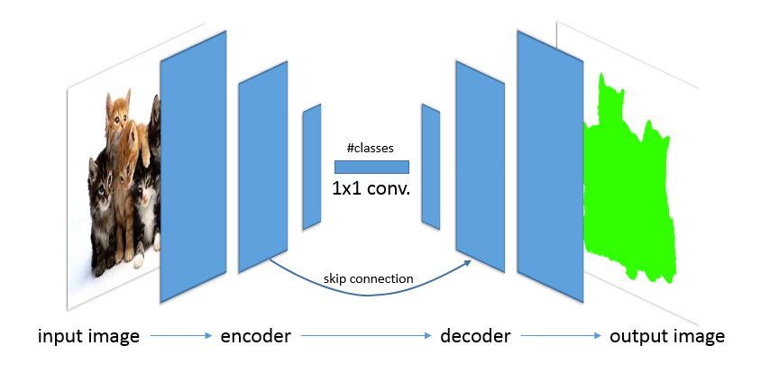
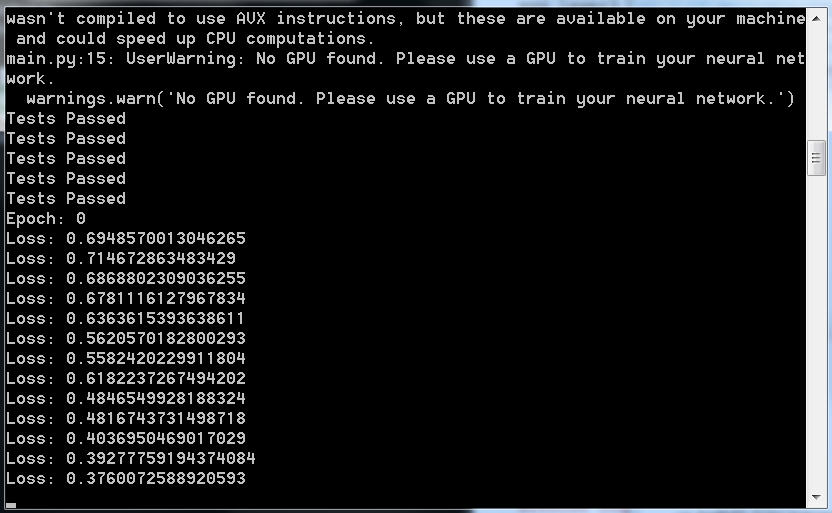
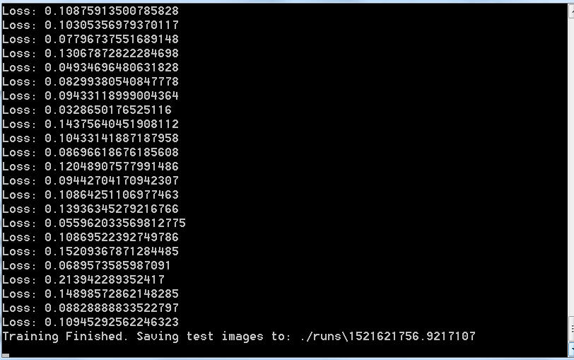
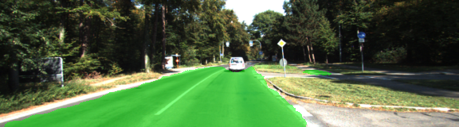
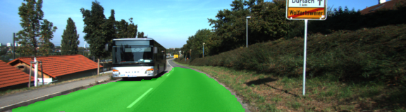
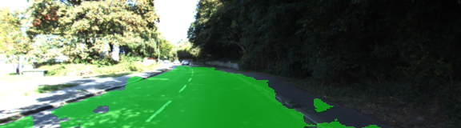
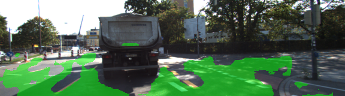

# Semantic Segmentation
---
The goal of this project is to train a fully convolutional network (FCN) to segment images into two pixel classes: road and non-road.
The decoding part of the FCN is based on the pre-trained VGG model.
The trained FCN must then be deployed on street images and/or videos.

## Implementation

The FCN is implemented in Python in the main.py file. The “data” directory contains the labeled images dataset to train the encoder plus some images for testing. The pre-trained decoder model is also saved in there.

The concept of fully convolutional network is explained briefly in the following drawing:

It is essentially divided in two parts:

•	An encoder, which extracts the features from the input image, like any convolutional network does. However, instead of ending with a fully-connected classifier head, the FCN encoder ends with a 1x1 convolution (kernel=1; stride=1) into a vector of classes to preserve spatial information.  

•	A decoder, which reconstructs the feature vector by means of upscaling “deconvolutions” or transposed convolutions, until an output image with the same size of the input is generated. The pixels of the output image are all classified in one of the possible classes.

In order to use information from different kernel sizes (i.e. at different resolutions), some “skip connections” are added between specular layers from the encoder directly to the decoder, thereby skipping the central part of the network. The incoming connection is added element-wise to the target decoding layer.

The output logits are simply 2D tensors, the first dimension being the list of pixels, while the second dimensions are the corresponding classes.

Training is done via standard backpropagation, e.g. with Adam optimizer, and the loss function is a softmax cross-entropy between the predicted output images and the labeled dataset.

Once the training is completed, the resulting graph can be frozen and used for inference. Some optimization techniques (operation fusing, quantization) can be added to improve performance for real-time deployment.

##Code explanation

The code is built up with different functions described here.

###Loading VGG model

The pre-trained VGG model is loaded here and some layers are extracted for further use. In particular, the input and output layer are saved, together with the pooling layers 3 and 4, from which skip connections to the decoder will depart.

	input_image, keep_prob, layer3_out, layer4_out, layer7_out = load_vgg(sess, vgg_path)

###Adding extra layers

We can now add extra layers to the graph:

•	A 1x1 convolution at the output of the VGG model

•	A first deconvolutional layer for the decoder

•	An added skip connection from pooling layer 4

•	A second deconvolutional layer for the decoder

•	An added skip connection from pooling layer 3

•	A final deconvolution to generate the final output image

Note that:

-	All transpose convolutions require “same” padding

-	A truncated normal initialization is used for all layers

-	An L2 regularization is added to all layers

-	Skipped connections are scaled down to match the output value range of the decoding layers

-	Skipped connections also go through a 1x1 convolution before being added to the decoding layers

The result is the output layer of the new network:

	output_layer = layers(layer3_out, layer4_out, layer7_out, num_classes)

###Configure the optimizer

The network is trained with an Adam optimizer using softmax cross-entropy loss.
Logits and labels are all resized to a [#pixels,#classes] tensor.

	logits, train_op, cross_entropy_loss = optimize(output_layer, correct_label, learning_rate, num_classes)

###Training
We let the training run on a standard CPU with the following parameters:

-	batch size = 2

-	learning rate = 0.001

-	dropout rate = 0.5

-	epochs = 5

		train_nn(sess, epochs, batch_size, get_batches_fn, train_op, cross_entropy_loss,
				 input_image, correct_label, keep_prob, learning_rate)

The loss starts high and quickly reduces to about 0.1 already during the first epoch.

By the end of the training the loss is still stable around 0.1, so adding more epochs is unlikely to help. The dataset is very small and long trainings are sure to overfit the network.

###Inference

Once training is completed the model is saved and can be reused for inference.

	helper.save_inference_samples(runs_dir, data_dir, sess, image_shape, logits, keep_prob, input_image)

The results on the test set are of acceptable quality, considering the very small size of the dataset.

Some are quite good…

Some others are quite bad:

##Comments

A larger dataset would certainly improve prediction quality.

Also, the VGG model is very resource-consuming. A smaller model, e.g. MobilNet, could be used with limited quality loss but massive performance improvement.
